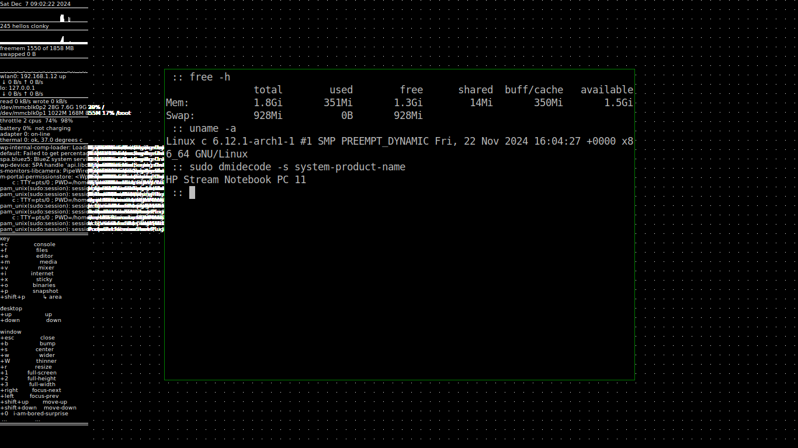

# osca

minimal X11 desktop environment

intention:
* a lightweight desktop environment for X11
* targets archlinux minimal installation
* runs on ubuntu
* a somewhat tongue-in-cheek approach to classics
* multiple desktops
* left hand on the keyboard, right hand on the mouse or touchpad
* intuitive move, resize, maximize, close windows without frames
* simplicity in source and extensions

contains:
* frameless: window manager, one source file
* clonky: system overview
* menuq: binary launcher
* snap: screenshot
* stickyo: sticky notes

