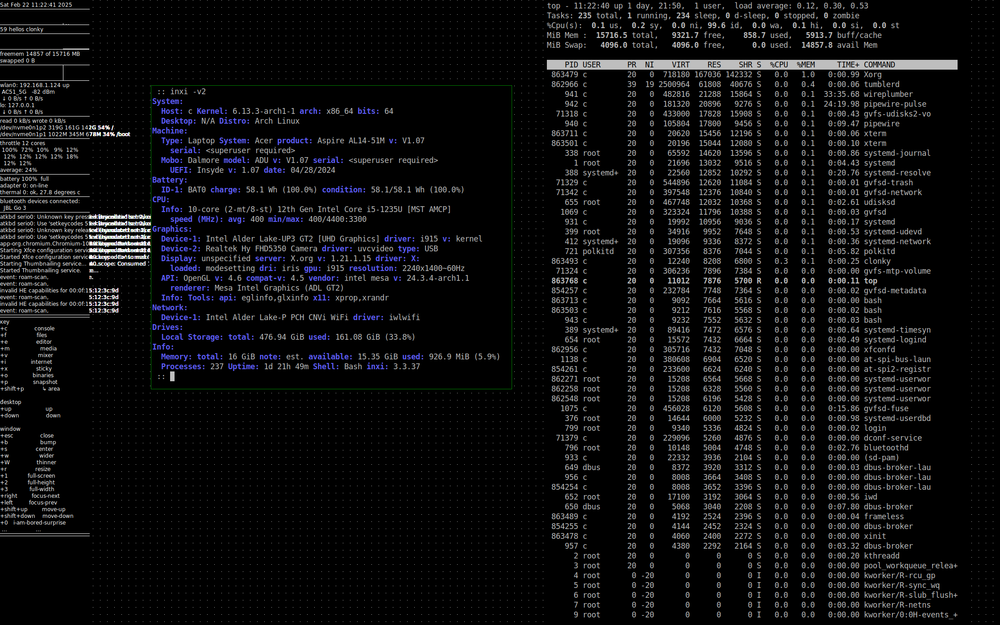
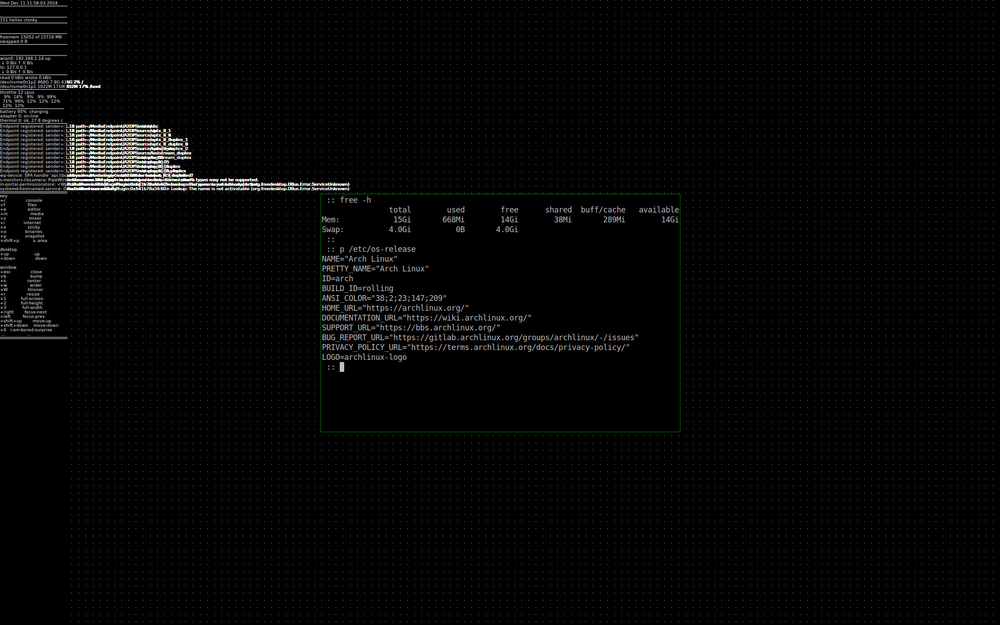
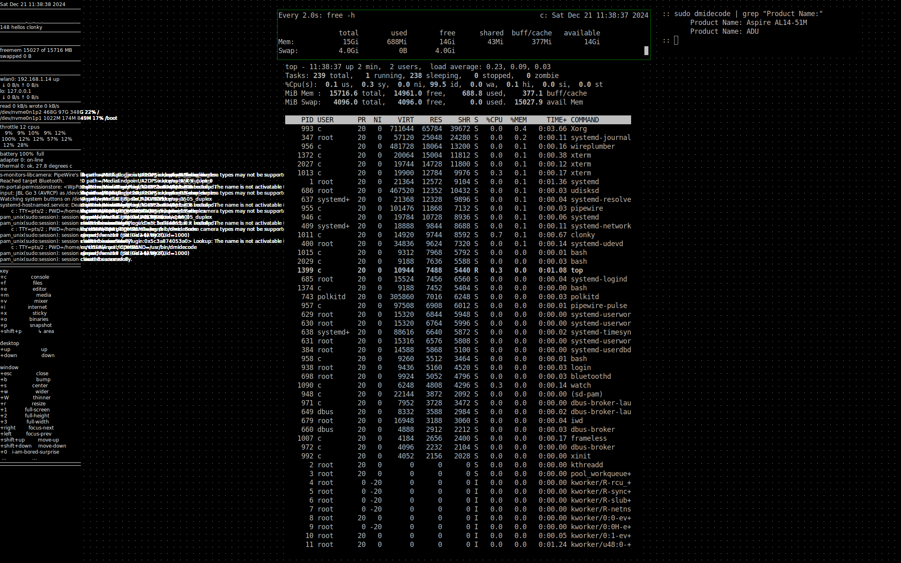

# osca

minimal X11 desktop environment

intention:
* a lightweight desktop environment for X11
* targets archlinux minimal installation
* runs on ubuntu
* a somewhat tongue-in-cheek approach to classics
* multiple desktops
* left hand on the keyboard, right hand on the mouse or touchpad
* intuitive move, resize, maximize, close windows without frames
* simplicity in source and extensions

contains:
* frameless: window manager, one source file
* clonky: system overview
* menuq: binary launcher
* snap: screenshot
* stickyo: sticky notes











```

            lines   words   chars
   source:    922    2841   28902
   zipped:     32     169    6492

-rwxr-xr-x 1 c 21600 Feb 22 11:23 frameless


            lines   words   chars
   source:   1302    4170   36185
   zipped:     33     220    8995

-rwxr-xr-x 1 c 36920 Feb 22 11:23 clonky


            lines   words   chars
   source:    210     754    6718
   zipped:      3      54    2290

-rwxr-xr-x 1 c 16440 Feb 22 11:23 menuq


            lines   words   chars
   source:     55     121    1856
   zipped:      1      15     802

-rwxr-xr-x 1 c 16552 Feb 22 11:23 stickyo


            lines   words   chars
   source:     21      60     589
   zipped:      2       9     329

-rwxr-xr-x 1 c 15632 Feb 22 11:23 snap

```
