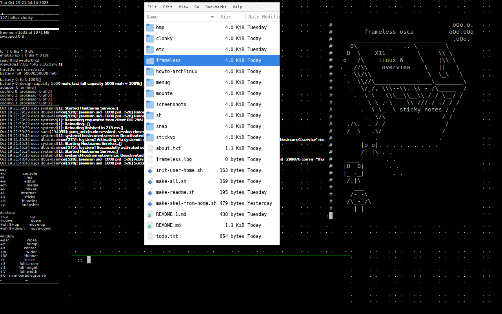

# osca

experimental minimal X11 desktop environment

intention:
* a lightweight desktop environment for X11
* targets archlinux minimal installation
* a somewhat tongue-in-cheek approach to classics

contains:
* frameless: one source file window manager
* clonky: system overview
* snap: screenshot
* stickyo: sticky notes
* menuq: binary launcher
* mounte: automatic mounter of USB





```

            lines   words   chars
   source:    789    2326   21005
   zipped:     14      98    5001

-rwxrwxr-x 1 c 21928 okt 21 21:37 frameless


            lines   words   chars
   source:   1138    3586   29909
   zipped:     18     158    7254

-rwxrwxr-x 1 c 37200 okt 21 21:37 clonky


            lines   words   chars
   source:    163     626    5011
   zipped:      8      43    1669

-rwxrwxr-x 1 c 16712 okt 21 21:37 menuq


            lines   words   chars
   source:     54     126    1724
   zipped:      1      15     810

-rwxrwxr-x 1 c 16960 okt 21 21:37 stickyo


            lines   words   chars
   source:     21      60     596
   zipped:      2       9     329

-rwxrwxr-x 1 c 16144 okt 21 21:37 snap


             lines  words   chars
   source:    118     344    3206
   zipped:      6      24    1141

-rwxrwxr-x 1 c 16872 okt 21 21:37 mounte

```
