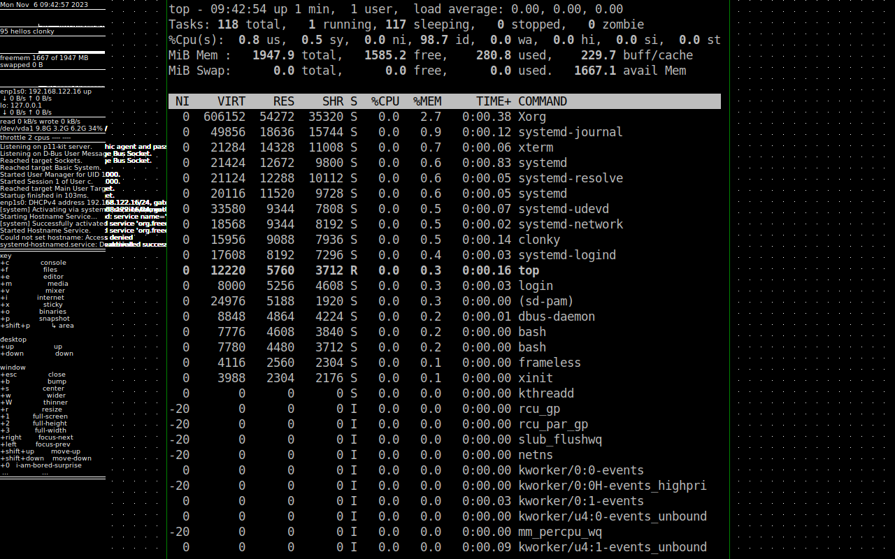
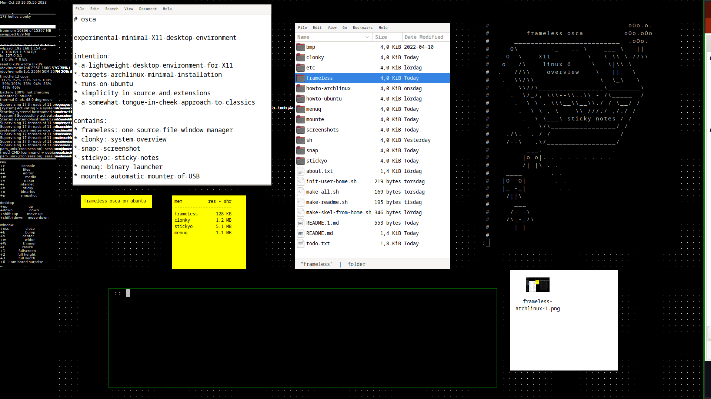
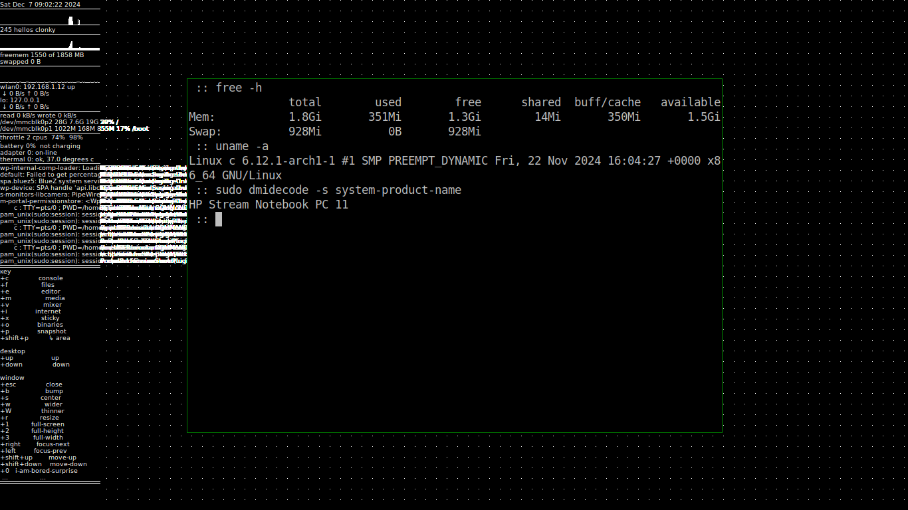

# osca

minimal X11 desktop environment

intention:
* a lightweight desktop environment for X11
* targets archlinux minimal installation
* runs on ubuntu
* a somewhat tongue-in-cheek approach to classics
* multiple desktops
* left hand on the keyboard, right hand on the mouse or touchpad
* intuitive move, resize, maximize, close windows without frames
* simplicity in source and extensions

contains:
* frameless: window manager, one source file
* clonky: system overview
* menuq: binary launcher
* snap: screenshot
* stickyo: sticky notes
* mounte: automatic mounter of USB











```

            lines   words   chars
   source:    875    2666   24686
   zipped:     20     146    5945

-rwxr-xr-x 1 c 17544 Dec  7 09:13 frameless


            lines   words   chars
   source:   1260    4073   34137
   zipped:     33     182    8401

-rwxr-xr-x 1 c 37296 Dec  7 09:13 clonky


            lines   words   chars
   source:    210     754    6718
   zipped:      3      54    2290

-rwxr-xr-x 1 c 16464 Dec  7 09:13 menuq


            lines   words   chars
   source:     55     121    1856
   zipped:      1      15     802

-rwxr-xr-x 1 c 16576 Dec  7 09:13 stickyo


            lines   words   chars
   source:     21      60     589
   zipped:      2       9     329

-rwxr-xr-x 1 c 15656 Dec  7 09:13 snap


             lines  words   chars
   source:    118     344    3206
   zipped:      6      27    1141

-rwxr-xr-x 1 c 16488 Dec  7 09:13 mounte

```
