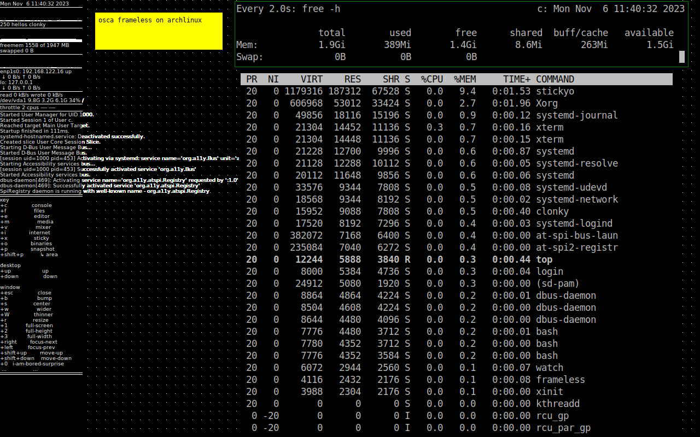
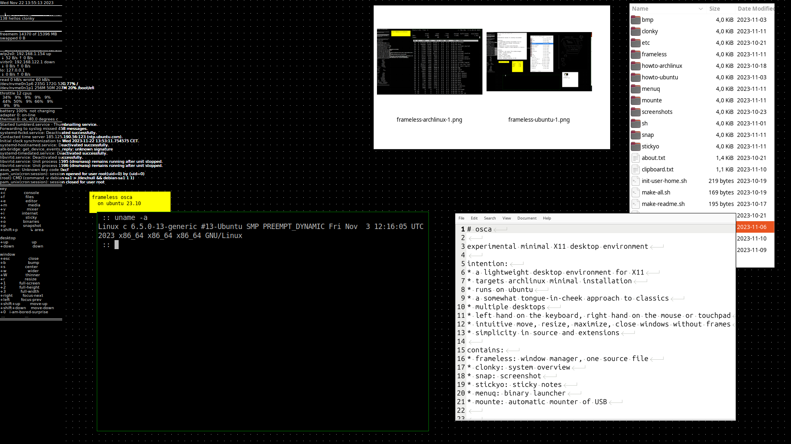

# osca

experimental minimal X11 desktop environment

intention:
* a lightweight desktop environment for X11
* targets archlinux minimal installation
* runs on ubuntu
* a somewhat tongue-in-cheek approach to classics

contains:
* frameless: one source file window manager
* clonky: system overview
* snap: screenshot
* stickyo: sticky notes
* menuq: binary launcher
* mounte: automatic mounter of USB







```

            lines   words   chars
   source:    853    2472   23373
   zipped:     17     118    5503

-rwxrwxr-x 1 c 21928 okt 22 04:05 frameless


            lines   words   chars
   source:   1153    3582   30685
   zipped:     26     190    7301

-rwxrwxr-x 1 c 37200 okt 22 04:05 clonky


            lines   words   chars
   source:    210     754    6718
   zipped:      3      52    2290

-rwxrwxr-x 1 c 16816 okt 22 04:05 menuq


            lines   words   chars
   source:     54     126    1724
   zipped:      1      15     810

-rwxrwxr-x 1 c 16960 okt 22 04:05 stickyo


            lines   words   chars
   source:     21      60     596
   zipped:      2       9     329

-rwxrwxr-x 1 c 16144 okt 22 04:05 snap


             lines  words   chars
   source:    118     344    3206
   zipped:      6      24    1141

-rwxrwxr-x 1 c 16872 okt 22 04:05 mounte

```
